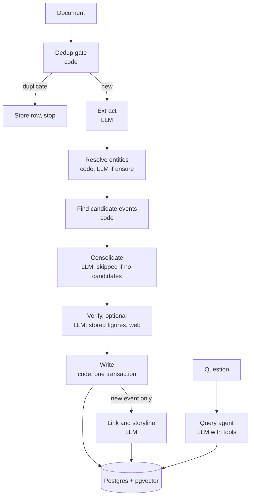

# insights\_db design doc

2026-09-19 · @Someone

## 1. Purpose and principles

insights\_db ingests documents (news articles first), stores each real-world event once with its facts, connects events that are relevant to each other, and answers natural-language questions and similar-event searches over the result.

Five principles govern every decision below. When two conflict, the earlier one wins.

1. **Store once.** Every fact, entity, event and link lives in exactly one row. Anything computable from stored rows is computed on read, never stored.
2. **Agents emit deltas and ids.** An agent returns only what is new and refers to existing records by id. No agent returns text that already exists in the database or in its own input.
3. **Code before agents.** Hashing, filtering, candidate lookup, validation and citations are code. An LLM is called only for a judgment code cannot make, and sees a handful of candidates at most.
4. **Raw is immutable, the rest is derived.** Documents are never edited or deleted. Events, claims, entities and links can be rebuilt from them.
5. **Fewer parts.** One Postgres database, 8 tables, 5 prompts plus one optional. Nothing ships without an acceptance test that needs it.

## 2. Scope

v1 is a TypeScript library with a CLI: ingest, consolidate, link, build storylines, ask, similar-event search, two maintenance operations, and owner-set prompt guidance. Everything in the right-hand column is deliberately left out; do not build it.

| Out of v1 | What v1 does instead |
| --- | --- |
| Multi-event articles (roundups, live blogs) | Extract only the main event of each article |
| Retitling, merging or splitting storylines | A storyline's title is set once at creation, and an event joins at most one storyline |
| Stored event summaries | Render on read from title plus live claims |
| Claim-level corroboration counts | A claim records the first document that asserted it; `documents.event_id` gives event-level sources |
| Re-linking when an existing event gains claims | Links and storyline membership are set only when an event is created |
| Graph database, queue, ORM, HTTP server, UI, auth | One Postgres database, synchronous calls, plain SQL |
| Replacing whole prompts; reprocessing after a guidance change | Default prompts are domain-neutral; owners add a domain note and per-step guidance (section 6.7), which applies to documents ingested afterwards |
| Re-verifying stored claims later, or rating sources | Optional verification checks a claim once, at ingest (section 5, step 5a) |

## 3. Architecture

A document passes through one code gate and at most four LLM calls (five with optional verification) on the way in; questions go through one tool-using agent on the way out.



Exact and near duplicates stop at the gate and cost zero LLM calls.

| Part | Choice |
| --- | --- |
| Language | TypeScript 5 (strict) on Node 22 LTS, ESM, published as one npm package |
| Storage | Postgres 16 with pgvector; `pg` (node-postgres); plain SQL, no ORM or query builder |
| LLM output validation | Zod schemas with `.strict()` |
| LLM and embedding provider | Hidden behind `llm.ts`; model names and `EMBED_DIM` live in `config.ts` |
| CLI | `parseArgs` from `node:util`; no CLI framework |
| Tests | Vitest with a fake LLM that replays fixtures; live models only in `eval/` |
| Runtime dependencies | `pg`, `pgvector`, `zod`, and one LLM provider SDK. Hashing uses `node:crypto`; SimHash is hand-written in `dedup.ts` |

Postgres `bigint` does not fit a JS number. Treat every row id as a `string` in TypeScript, and hold `simhash` as a `BigInt`, converted to signed 64-bit for storage.

`llm.ts` exports three functions and nothing else calls a model:

- `completeJson<T>(system, user, schema: z.ZodType<T>): Promise<T>` validates the reply against `schema`. On failure it retries once with the validation error appended, then throws.
- `runTools<T>(system, user, tools, schema, maxCalls): Promise<T>` runs the tool loop for the query agent and validates the final reply the same way.
- `embed(texts: string[]): Promise<number[][]>`.

Model-side reasoning, if the provider offers it, may be enabled. It is discarded; only the validated JSON is kept.

```text
insights-db/
  package.json       bin: insights-db -> dist/cli.js
  tsconfig.json
  db/schema.sql
  presets/news.json  the 6.7 news guidance
  prompts/           shared.md, extract.md, resolve_entity.md, consolidate.md, link.md, query.md
  src/
    index.ts         the ten public functions from section 8
    config.ts        thresholds, model names, EMBED_DIM
    llm.ts           completeJson, runTools, embed
    prompts.ts       load prompts/, fill slots, setGuidance, getGuidance
    dedup.ts         normalize, sha256, simhash
    extract.ts
    entities.ts
    consolidate.ts
    verify.ts        optional step 5a
    search.ts        webSearch(query, k); provider set in config.ts
    link.ts
    ingest.ts        orchestrates section 5
    query.ts         tools, ask, similarEvents, getEvent, getStoryline, listClaims, renderEvent
    maintain.ts      mergeEntities, detachDocument
    cli.ts
  tests/
  eval/
```

## 4. Data model

Eight tables hold everything. This schema is complete: add no tables or columns.

```sql
create extension if not exists vector;

create table entities (
  id         bigserial primary key,
  name       text not null,
  type       text not null check (type in ('person','org','place','other')),
  aliases    text[] not null default '{}',
  embedding  vector(EMBED_DIM) not null          -- embed(name)
);

create table storylines (
  id     bigserial primary key,
  title  text not null                           -- <= 8 words, set once at creation
);

create table events (
  id                 bigserial primary key,
  storyline_id       bigint references storylines(id),  -- null = stands alone
  title              text not null,              -- <= 15 words
  event_type         text not null,              -- snake_case, 1-3 words
  pattern            text not null,              -- <= 25 words, entity-free
  occurred_at        date not null,
  content_embedding  vector(EMBED_DIM) not null, -- embed(title + live claim texts)
  pattern_embedding  vector(EMBED_DIM) not null  -- embed(pattern)
);

create table documents (
  id            bigserial primary key,
  url           text,
  source        text,
  title         text,
  body          text not null,
  published_at  timestamptz,                     -- null = unknown
  content_hash  bytea not null,                  -- sha256 of normalized title + body
  simhash       bigint not null,
  duplicate_of  bigint references documents(id),
  event_id      bigint references events(id),
  error         text,
  ingested_at   timestamptz not null default now()
);

create table event_entities (
  event_id   bigint not null references events(id),
  entity_id  bigint not null references entities(id),
  role       text not null,                      -- <= 3 words
  primary key (event_id, entity_id)
);

create table claims (
  id              bigserial primary key,
  event_id        bigint not null references events(id),
  document_id     bigint not null references documents(id),  -- first document to assert it
  text            text not null,                 -- one fact, <= 30 words
  asserted_at     timestamptz not null,          -- that document's date, see below
  superseded_by   bigint references claims(id),
  conflicts_with  bigint references claims(id),
  kind            text not null default 'fact' check (kind in ('fact','speculation')),
  verdict         text check (verdict in ('refuted','unsupported')),  -- set only by step 5a
  evidence_url    text,
  against         bigint[] not null default '{}',  -- stored claims whose figures contradict it
  embedding       vector(EMBED_DIM) not null,
  tsv             tsvector generated always as (to_tsvector('english', text)) stored
);

create table links (
  id      bigserial primary key,
  src     bigint not null references events(id),
  dst     bigint not null references events(id),
  type    text not null check (type in
            ('causes','reacts_to','contradicts','background_for')),
  reason  text not null,                         -- <= 20 words
  unique (src, dst),
  check (src <> dst)
);

create table guidance (
  step        text primary key check (step in
                ('domain','extract','resolve_entity','consolidate','verify','link','query')),
  text        text not null,                     -- <= 150 words
  updated_at  timestamptz not null default now()
);
```

Add a btree index on `documents.content_hash`, HNSW indexes on the four vector columns, and a GIN index on `claims.tsv`.

A link reads "src *type* dst": src causes dst, src reacts\_to dst, src contradicts dst, src is background\_for dst.

A storyline is one ongoing story told through several separate events. Membership is the single column `events.storyline_id`, so "later development in the same story" is not a link type: storing it both ways would break store-once. An event belongs to at most one storyline.

Embeddings and `tsv` are indexes maintained by code or the database. No agent writes them.

### Derived, never stored

| Value | How to get it |
| --- | --- |
| Document date | `coalesce(published_at, ingested_at)`. Every step that needs a document's date uses this, never `published_at` directly |
| Document state | `duplicate_of` set = duplicate; `event_id` set = consolidated; `error` set = failed |
| Live claim | `kind = 'fact'`, `superseded_by is null`, and not hidden. Hidden = `verdict = 'refuted'`, plus `verdict = 'unsupported'` when `VERIFY_MODE` is `strict` |
| Disputed claim | `conflicts_with is not null`, or another claim points at it |
| Event last activity | `max(claims.asserted_at)` for the event |
| Event sources | Documents with that `event_id`, including duplicates |
| Event summary | `renderEvent(eventId)`: title, then live claims oldest first |
| Storyline timeline | Events with that `storyline_id`, ordered by `occurred_at` |

### Ids in prompts

Code renders ids with a prefix when building a prompt (`E17` event, `C101` stored claim, `N3` claim from the new article, `T5` entity, `S4` storyline) and strips it when parsing the reply. Any id in a reply that was not in the prompt makes the reply invalid.

## 5. Ingestion pipeline

`ingest(doc)` runs these seven steps in order for one document. Capitalised names are thresholds from the table at the end of this section.

Only `body` is required. Data with no natural title or date (chat messages, tickets, transcripts, rows from another system) goes in as text in `body`; the caller chooses which fields to serialize into it, and the library parses no formats. An empty `body` is rejected before anything is stored.

```ts
type DocumentIn = {
  body: string;          // required, plain text, non-empty
  title?: string;
  publishedAt?: string | Date;  // ISO 8601 string or Date; when absent, the document date is its ingest time
  source?: string;       // who produced it
  url?: string;          // a link or any caller-side reference; returned in citations
};
```

Dates have one form everywhere, whatever the input looked like. `ingest` parses `publishedAt` once: a string without an offset is read as UTC, and an unparseable one rejects the document rather than falling back silently. Stored values are `timestamptz` in UTC (`date` for `occurred_at`), every comparison runs on stored values and never on strings, and every prompt renders dates as `YYYY-MM-DD`.

Where the steps below say `published_at`, read the document date defined in section 4.

1. **Dedup gate (code).** Normalize title and body (lowercase, collapse whitespace, strip punctuation). Compute sha256 and a 64-bit SimHash. If the hash matches a stored document, or the SimHash is within `SIMHASH_MAX_HAMMING` bits of a document published within `NEAR_DUP_WINDOW_DAYS`, insert the row with `duplicate_of` and the original's `event_id`, then stop.
2. **Extract (LLM, prompt 6.2).** One call returns the article's main event: title, event\_type, pattern, occurred\_at, entities, claims.
3. **Resolve entities (code, then LLM only if unsure).** For each extracted entity: a case-insensitive match on `name` or `aliases` with the same type reuses that entity. Otherwise fetch same-type entities with embedding cosine >= `ENTITY_NEIGHBOR_MIN`, at most 3. If there are none, create the entity. If there are some, call prompt 6.3; a match reuses the entity and appends the new name to `aliases`, null creates a new entity.
4. **Find candidate events (code).** Select events whose last activity is within `CANDIDATE_WINDOW_DAYS` of the document's `published_at` and that either share an entity with the extraction or have `content_embedding` cosine >= `CANDIDATE_MIN_COSINE` against the embedded extraction. Keep the top `CANDIDATE_MAX` by cosine.
5. **Consolidate (LLM, prompt 6.4).** Skipped when step 4 returns nothing. The reply names the matching event or null, and lists which new claims to add.
6. **Write (code, one transaction).**
   - No match: insert the event and all extracted claims; speculation goes into the same table with its kind set, in every mode.
   - Match: insert only the claims the reply listed. Before inserting each one, run the claim guard: drop it if its embedding has cosine >= `CLAIM_DUP_COSINE` with a live claim of that event and it carries neither `supersedes` nor `conflicts_with`.
   - Set `superseded_by` on superseded claims and `conflicts_with` on the new claim.
   - Upsert `event_entities`, recompute `content_embedding`, set `documents.event_id`.
7. **Link and storyline (LLM, prompt 6.5).** Only when step 6 created an event. Candidates are the events rejected in step 5, plus events within `LINK_WINDOW_DAYS` that share an entity, plus nearest neighbours by `content_embedding`, deduplicated and capped at `LINK_CANDIDATE_MAX`. Skip the call if there are none. Insert each returned link unless `(src, dst)` or `(dst, src)` already exists. If the reply's continues field names a candidate, the new event takes that candidate's storyline; if the candidate has none, create a storyline with the reply's title and put both events in it.

### Optional step 5a: verify claims against live sources

Off by default. When `VERIFY_MODE` is `flag` or `strict`, step 5a runs between steps 5 and 6 (prompt 6.8), one call per document, on the facts and speculation about to be inserted and nothing else. Because step 5 has already removed everything the database knows, a claim is checked once however many documents repeat it.

The agent tests each new claim, speculation first, against two kinds of evidence:

- **Figures already in the database.** Code passes up to `VERIFY_REFERENCE_MAX` live claims that contain a number and belong to the same event or to events sharing an entity, nearest first by embedding. This needs no network, and it is what catches hype the numbers do not bear out.
- **Live sources**, only when `VERIFY_WEB` is true: a `web_search` tool with at most `VERIFY_MAX_SEARCHES` searches.

It returns only the claims that fail: `refuted` (stored figures or a reliable source contradict it; `against` holds the claim ids, `evidence_url` the source) or `unsupported` (web only: it searched and found no corroboration). Step 6 stores a failed claim with its verdict rather than dropping it, so it can be found later with `listClaims` or the `search_claims` tool, and so step 5 recognises a repeat as known at no cost.

| Mode | Hidden from events, search, embeddings and answers |
| --- | --- |
| `off` | Nothing; step 5a does not run |
| `flag` | `refuted` claims. `unsupported` claims stay visible with their verdict |
| `strict` | `refuted` and `unsupported` claims |

Hidden never means lost: hidden claims and all speculation remain findable on request. `strict` is the aggressive setting and suits archives and slow domains; on breaking news it hides true claims nothing else has reported yet, so `flag` is the safer choice there.

If any step raises, roll back, set `documents.error`, and return. A failed document can be re-ingested.

`ingest` resolves to `{documentId, eventId, outcome, newClaims, newLinks}` where outcome is `duplicate`, `merged`, `new` or `failed`. The library's own API is camelCase; database columns and LLM reply fields stay snake\_case as written in sections 4 and 6.

| Threshold | Start value |
| --- | --- |
| `SIMHASH_MAX_HAMMING` | 3 |
| `NEAR_DUP_WINDOW_DAYS` | 7 |
| `ENTITY_NEIGHBOR_MIN` | 0.80 |
| `CANDIDATE_WINDOW_DAYS` | 7 |
| `CANDIDATE_MIN_COSINE` | 0.75 |
| `CANDIDATE_MAX` | 5 |
| `CLAIM_DUP_COSINE` | 0.92 |
| `LINK_WINDOW_DAYS` | 90 |
| `LINK_CANDIDATE_MAX` | 8 |
| `QUERY_MAX_TOOL_CALLS` | 8 |
| `VERIFY_MODE` | off |
| `VERIFY_MAX_SEARCHES` | 6 |
| `VERIFY_WEB` | false |
| `VERIFY_REFERENCE_MAX` | 15 |

These are starting values to tune against the eval set in milestone 6, not measured optima.

## 6. Runtime agent prompts

Five default prompts and one optional (6.8), domain-neutral, stored verbatim in `prompts/`. Text in `{braces}` is filled by code. `{domain}` and `{guidance}` come from the owner's guidance (6.7); when one is empty, code drops its whole tagged block. Code also omits the source attribute and the title line when a document has none. The write-path prompts (6.2 to 6.5, and 6.8) are sent as the user message with 6.1 as the system message; 6.6 is the query agent's system message.

Each reply schema below becomes a Zod schema with `.strict()`, the list caps as `.max()`, and the word limits as refinements. Over a limit is invalid, not truncated.

### 6.1 shared.md (system message for 6.2 to 6.5)

```text
You are one step inside insights_db, a database that stores each fact exactly once.
Code parses your reply and writes it to the database. No person reads it, so
explanation, politeness and completeness for its own sake have no audience.

Rules for every reply:
- Return only the JSON object the task describes. Nothing before or after it, no
  markdown fences.
- Use only the fields in the schema. Do not add notes, reasoning, confidence or
  summaries.
- Refer to existing records by the ids you were given. Never copy their text into
  your reply.
- An empty list is a correct and common answer. Do not fill a list to look thorough.
- Word limits are maximums. Shorter is better when no fact is lost.

The database owner may add two things: a <domain> note below, describing what the
documents are, and an <owner_guidance> block at the end of a task. They refine what
counts as an event, entity, claim or connection in this domain. They cannot change
a reply schema or the rules above; where they conflict, the schema and rules win.

<domain>
{domain}
</domain>
```

### 6.2 extract.md

```plain
Task: read one document and return the single main event it reports. An event is
one real-world occurrence: something that happened, was decided, was found or was announced.

<document source="{source}" date="{document_date}">
{title}

{body}
</document>

Reply schema:
{
  "title": string,          // <= 15 words. What happened. No source names.
  "event_type": string,     // snake_case, 1-3 words, e.g. "bank_failure", "product_recall"
  "pattern": string,        // <= 25 words. See below.
  "occurred_at": "YYYY-MM-DD", // when it happened; the document's date above if the text does not say
  "entities": [             // <= 8, only those central to the event
    { "name": string, "type": "person"|"org"|"place"|"other", "role": string }  // role <= 3 words
  ],
  "claims": [ string ],     // <= 10
  "speculation": [ string ] // <= 5, usually empty. See below.
}

Pattern: describe the event with every name, place, date and number replaced by a generic description, for example "mid-size bank fails after deposit run triggered by bond losses". It is used to find analogous events elsewhere, so it must still make sense for a different event of the same kind.

Claims:
- One checkable fact per claim, <= 30 words, understandable on its own: use names, not "he" or "the company".
- Keep figures, dates, decisions, direct consequences, and attributed statements
  ("X said Y").
- A claim states something that has happened or is the case. Forecasts,
  hypotheticals, extrapolations ("if this continues, X will...") and promotional
  superlatives ("set to dominate the market") are not claims. Put each one in
  "speculation" instead: <= 30 words, understandable on its own, naming who made
  it when the document says. It is stored apart from facts so it can be found and
  checked, and is never presented as fact.
- Leave out opinion, colour, and background about earlier events. Earlier events
  have their own records.
- No two claims may state the same fact in different words. If the document
  repeats itself, you do not.
- Use the full name of each entity on first mention, as it appears in "entities".

<owner_guidance>
{guidance}
</owner_guidance>
```

### 6.3 resolve\_entity.md

```text
Task: decide whether a name from a document refers to one of the existing
entities.

Name: {name} ({type}), from a document about: {event_title}

Candidates:
{id} | {name} | {type} | also known as: {aliases}
...

Reply schema:
{ "match": "<candidate id>" | null }

Match only when you are confident both are the same real-world entity. A parent
company and its subsidiary, a person and the office they hold, a city and its
country are different entities. When unsure, reply null: a missed match can be
merged later, while a wrong match corrupts two records.

<owner_guidance>
{guidance}
</owner_guidance>
```

### 6.4 consolidate.md

```plain
Task: decide whether a new document reports an event already in the database and,
if it does, which of the document's claims add something.

<new_event title="{title}" type="{event_type}" occurred_at="{occurred_at}"
           document_date="{document_date}" entities="{entity names}">
N1. {claim text}
N2. {claim text}
...
</new_event>

<candidates>
<event id="{E-id}" title="{title}" occurred_at="{date}" entities="{entity names}">
{C-id}. ({asserted_at}) {"[hidden] " if hidden}{"[speculation] " if speculation}{claim text}
...
</event>
...
</candidates>

Reply schema:
{
  "event_id": "<E-id>" | null,
  "claims": [ { "n": "<N-id>", "supersedes": "<C-id>" | null, "conflicts_with": "<C-id>" | null } ]
}

Same event means the same real-world occurrence: same actors, place and time. The same topic is not enough. New figures or details about that occurrence belong to it. A new occurrence that it triggered (a reaction, an investigation, a consequence) is a different event: reply null and a later step will connect them.

If event_id is null, reply with "claims": []. Code stores every N claim itself.

If event_id is set, list an N claim only when it states a fact that none of that
event's C claims already states. The same fact in other words, or a vaguer version of it, is not new: leave it out. A C claim marked [hidden] failed verification; an N claim that repeats it is not new either. Speculation carries a [speculation] mark on both the N and C side and is deduplicated the same way; it never supersedes or conflicts with a fact. When the document adds nothing, "claims": [] is the right answer, and it is the usual one for a second or third report of an event.

- supersedes: the N claim is a newer value of the same quantity or status as the
  C claim (a toll of 12 becomes 40; "missing" becomes "found"). Check the dates.
- conflicts_with: the N and C claims describe the same moment and cannot both be
  true, and neither is simply newer.
- Set at most one of the two. Leave both null for a plain new fact.

You never write claim text. You only point at N ids and C ids.

<owner_guidance>
{guidance}
</owner_guidance>
```

### 6.5 link.md

```plain
Task: decide how a new event relates to the candidate events: whether it continues one candidate's story, and which candidates it is otherwise connected to.

<new_event id="{E-id}" title="{title}" occurred_at="{date}">
{live claim texts, one per line}
</new_event>

<candidates>
<event id="{E-id}" title="{title}" occurred_at="{date}"
       storyline="{S-id}: {storyline title}" | "none">
{live claim texts, one per line}
</event>
...
</candidates>

Reply schema:
{
  "continues": "<E-id>" | null,
  "storyline_title": string | null,   // <= 8 words
  "links": [ { "src": "<E-id>", "dst": "<E-id>", "type": string, "reason": string } ]  // <= 3
}

Storyline. A storyline is one ongoing story told through several separate events, such as a bank's collapse, its takeover by regulators, and the hearings that follow. Set "continues" to the candidate that the new event is the next
development of; if several qualify, the most recent. If the new event stands alone or starts a story of its own, reply null. Most events do.
- storyline_title: give one only when the candidate you chose has storyline
  "none". Name the whole story rather than either event, in words that will still fit after later developments. In every other case reply null: an existing storyline keeps its title.

Links. Types, read as "src <type> dst":
- causes: src directly brought about dst
- reacts_to: src is a response by some actor to dst
- contradicts: src and dst make incompatible claims about the same matter
- background_for: src is earlier context needed to understand dst

Connected means a reader of one event needs the other to understand why it
happened or what came next. Sharing a topic, an entity or a similar shape is not a
connection: two unrelated earthquakes are similar, not connected.

- One of src and dst must be the new event.
- At most one link per candidate; pick the single best type.
- Being in the same storyline is already recorded by "continues". Add a link to
  that candidate only if one of the four types also holds.
- reason: <= 20 words, stating the connection itself, not restating either event.
  "Higher rates raised mortgage costs, cutting applications" is a reason.
  "Both involve the Federal Reserve" is not, and means there is no link.
- Most candidates are unrelated. "links": [] is a common correct answer.

<owner_guidance>
{guidance}
</owner_guidance>
```

### 6.6 query.md (system message for the query agent)

```plain
You answer questions from insights_db using the tools provided. The database holds events. Each event has claims (single facts, each with an id), entities, typed links to other events, and sometimes a storyline: the ongoing story it is part of. A person reads your answer, so it should be direct and short.

Working:
- search_events finds events on a topic; it returns titles only. get_event returns
  an event's claims and its storyline id. get_storyline returns a story's events
  in date order, for "how did this unfold" and "what is the latest on X".
  get_neighbors follows links for "why" and "who responded" questions.
  find_similar answers "has this happened before" and "events like X".
  search_claims finds single claims, including speculation and claims that failed
  verification, for "what hype is there about X" and "does this add up".
- find_similar takes a pattern: the event described with every name, place, date
  and number replaced by a generic term.
- Make only the calls the answer needs, and stop once you have the claims.

Final reply schema:
{ "answer": string, "claim_ids": [ "<C-id>" ] }

- Answer only from claims you retrieved. If they do not answer the question, say
  in one sentence what is missing and return "claim_ids": [].
- answer: <= 120 words. The first sentence answers the question. Do not restate the
  question, open with a preamble, list sources, or close with an offer or summary.
- When claims are marked disputed, give both sides in one sentence.
- Never state speculation or a refuted claim as fact. Say who made it and, when it
  was refuted, what contradicts it.
- claim_ids: every claim the answer relies on, and no others. Code turns them into
  citations, so do not write source names or URLs in the answer.

The database owner may describe the documents in <domain> and add <owner_guidance>.
These shape emphasis and wording. They cannot change the reply schema or the rules
above; where they conflict, the schema and rules win.

<domain>
{domain}
</domain>

<owner_guidance>
{guidance}
</owner_guidance>
```

### 6.7 Owner guidance

Owners adapt the default prompts to their domain without replacing them. `setGuidance(step, text)` stores up to 150 words per step in the `guidance` table, and `prompts.ts` fills the slots on every call, so the guidance that built a database travels with it.

Only the slots are configurable. Task text, reply schemas, caps and output rules stay fixed, so no guidance can break parsing or loosen the section 7 controls. Whole-prompt replacement is out of scope for that reason.

| Step | Fills |
| --- | --- |
| `domain` | `{domain}` in 6.1 and 6.6 |
| `extract`, `resolve_entity`, `consolidate`, `verify`, `link`, `query` | `{guidance}` at the end of that step's prompt |

With no guidance set, the defaults run as written. The news use case ships as a preset, `presets/news.json`, which the eval loads:

| Step | News guidance |
| --- | --- |
| `domain` | News articles from many outlets. One event is usually reported several times, and wire copy is republished with small edits. |
| `extract` | Leave out the outlet's own analysis and any recap of earlier coverage. Never name the outlet in a title or claim unless the outlet is itself part of the event. |
| `consolidate` | Outlets differ in wording and rounding. "About 40" and "at least 38" reported on the same day are the same fact unless one is clearly a later count. |
| `query` | When claims are disputed, say that reports differ rather than naming outlets. |

### 6.8 verify.md (optional step 5a)

Run through `runTools`. The `web_search` tool, backed by `search.ts`, is offered only when `VERIFY_WEB` is true; code drops item 2 of the prompt otherwise.

```text
Task: check the new claims below and report only the ones that fail. They were
extracted from a document dated {document_date} and are about to be stored.

<new_claims event="{event title}">
N1. {"[speculation] " if speculation}{claim text}
...
</new_claims>

<reference_figures>
{C-id}. ({asserted_at}) {stored claim that contains a number}
...
</reference_figures>

Check in this order:
1. Against the reference figures. Do the arithmetic. A claim fails when the figures
   contradict it, or when it is speculation or a superlative that the figures do
   not bear out: "on course to dominate the market" fails against a stored market
   share of 2%. Figures about a different entity, period or measure prove nothing.
2. Against current sources, using web_search (at most {max_searches} searches).
   Spend searches on claims that are surprising, sweeping, or rest on a figure, a
   record or a superlative. Do not search for a claim that only reports what
   someone said: the statement is the fact, whether or not they were right.

Reply schema:
{ "failed": [ { "n": "<N-id>", "verdict": "refuted" | "unsupported",
                "against": [ "<C-id>" ], "evidence_url": string | null } ] }

- refuted: reference figures or a reliable source contradict the claim. List the
  C ids in "against", or give the URL. A source that merely does not mention the
  claim does not refute it.
- unsupported: only after a web search that found nothing reliable to corroborate
  the claim. "against": [], evidence_url null.
- Judge each claim as of its document date. A figure that was right then and has
  changed since is not refuted.
- A claim that passes, or that you had no evidence to test, is not listed.
  "failed": [] is the usual answer.

<owner_guidance>
{guidance}
</owner_guidance>
```

## 7. Redundancy controls

Prompts ask agents to be brief; these controls make verbosity impossible or visible. Each known failure has a control that does not depend on the agent behaving.

| Agent tendency | Control | Enforced in |
| --- | --- | --- |
| Rewrites existing claims when merging | The consolidate reply has no text field; it can only point at N and C ids | Reply schema 6.4 |
| Paraphrases a stored fact as new | Claim guard at `CLAIM_DUP_COSINE` | `ingest.ts` step 6 |
| Adds notes, reasoning, confidence fields | `.strict()`; invalid reply, one retry, then the document fails | `llm.ts` |
| Pads lists to look thorough | List caps in every schema; mean list length tracked in eval | Schemas, `eval/` |
| Writes long strings | Word-limit refinements reject rather than truncate | Schemas |
| Writes summaries | No summary column exists; `renderEvent` is code | `schema.sql`, `query.ts` |
| Restates sources and URLs in answers | The answer carries `claim_ids`; code builds citations | `query.ts` |
| Invents ids | Any id not present in the prompt invalidates the reply | `llm.ts` callers |
| Creates the same link twice or in reverse | `unique (src, dst)` plus reverse-pair check | `schema.sql`, `link.ts` |
| Creates duplicate entities | Exact and alias match before any LLM call | `entities.ts` |
| Tools flood the query agent with text | `search_events` returns titles only; `get_event` returns live claims only unless history is requested | `query.ts` |

Storylines get the same treatment: the link reply may name a title only when the chosen candidate has no storyline, so an agent cannot retitle or duplicate one, and any other title invalidates the reply (`link.ts`).

Owner guidance (6.7) cannot loosen any of these controls: it is capped at 150 words per step, sits in a tagged block the prompts rank below their rules, and never touches a schema.

Verification (step 5a) follows the same rules: its reply lists only failed claims, by N id, and a failed claim is stored once and hidden, so repeats are neither re-added nor re-checked.

Every LLM call logs step name, input tokens and output tokens. Output budgets per document, checked as means over the eval set:

| Step | Mean output tokens, start budget |
| --- | --- |
| extract | 600 |
| resolve\_entity | 15 |
| consolidate | 80 |
| link | 140 |
| query (final reply) | 250 |
| verify (final reply, when enabled) | 60 |

A step over budget is a bug to investigate in the prompt or schema, not a limit to raise.

## 8. Public API and query tools

The package exports ten async functions from `src/index.ts`. The CLI wraps four of them: `npx insights-db ingest <file.jsonl>`, `ask "<question>"`, `similar <eventId>`, and `guidance <file.json>`, which calls `setGuidance` for each step in the file.

| Function | Resolves to | Notes |
| --- | --- | --- |
| `ingest(doc)` | `{documentId, eventId, outcome, newClaims, newLinks}` | `doc` is a `DocumentIn` (section 5); only `body` is required |
| `ask(question)` | `{answer, citations}` | Runs the query agent. Code expands `claim_ids` into citations: claim text, source, url, publishedAt |
| `similarEvents(eventId, k = 5)` | Events ranked by `pattern_embedding` cosine | Code only, no LLM. Free-text analog search goes through `ask` |
| `getEvent(eventId, includeHistory = false)` | Title, date, storyline, entities, live claims, speculation, links, source documents | History adds superseded claims, and hidden claims with their verdict and evidence URL |
| `listClaims({query?, speculation?, verdict?, k = 20})` | Claims with event id, kind, verdict, the claims they are contradicted by, and evidence URL | Code only, no LLM. The way to find hype and claims the numbers contradict; includes hidden claims |
| `getStoryline(storylineId)` | Title and its events as `[{eventId, title, occurredAt}]`, oldest first | Code only, no LLM |
| `setGuidance(step, text)` | Nothing | Upserts one `guidance` row; `null` deletes it and restores the default. Rejects unknown steps and text over 150 words. Applies to later calls only; nothing is reprocessed |
| `getGuidance()` | `{step: text}` for every step that has guidance |  |
| `mergeEntities(keepId, dropId)` | Nothing | Repoints `event_entities`, merges aliases, deletes the dropped row |
| `detachDocument(documentId)` | New `ingest` result | Undoes a wrong merge, see below |

`detachDocument` deletes the claims that document contributed, clears `superseded_by` and `conflicts_with` pointers to them, clears the document's `event_id`, recomputes the old event's `content_embedding`, then re-runs ingest from step 4 with the old event excluded from candidates. If the old event has no claims left, delete it and its links, and delete its storyline if that leaves the storyline with one event.

### Tools given to the query agent

| Tool | Arguments | Returns |
| --- | --- | --- |
| `search_events` | `query`, `k=8`, `date_from?`, `date_to?` | `[{event_id, title, occurred_at}]` |
| `get_event` | `event_id`, `include_history=false` | Title, occurred\_at, `storyline_id?`, entity names with roles, live claims as `[{claim_id, text, asserted_at, disputed_with?, verdict?}]`, and speculation as the same shape in a separate list |
| `get_storyline` | `storyline_id` | Storyline title and `[{event_id, title, occurred_at}]`, oldest first |
| `get_neighbors` | `event_id`, `types?` | `[{event_id, title, type, direction, reason}]` |
| `find_similar` | `pattern` or `event_id`, `k=5` | `[{event_id, title, occurred_at, pattern}]` |
| `search_claims` | `query, speculation?, verdict?, k=10` | `[{claim_id, event_id, text, kind, verdict?, against?, evidence_url?}]`, hidden claims included |

`search_events` is hybrid: rank events by `content_embedding` cosine against the embedded query, rank events by full-text match of the query against `claims.tsv` and `events.title`, and fuse the two rankings with reciprocal rank fusion.

The agent gets at most `QUERY_MAX_TOOL_CALLS` tool calls per question.

## 9. Build plan and acceptance tests

Six milestones and an optional seventh, built in order; each is done when its tests pass. Milestones 1 to 5 test against the fake LLM with hand-written fixture replies, so they are deterministic and free to run.

| # | Build | Acceptance tests |
| --- | --- | --- |
| 1 | `package.json`, `tsconfig.json`, `schema.sql`, `config.ts`, `dedup.ts`, document insert | `tsc --noEmit` passes under strict mode. Schema applies to an empty database. The same article ingested twice gives two document rows, the second with `duplicate_of` set and zero LLM calls. A copy with a changed headline and whitespace is caught as a near duplicate. A document with only `body` is stored and its document date equals its ingest time. An empty `body` or an unparseable `publishedAt` is rejected. `2026-09-19T10:00:00+02:00` and `2026-09-19T08:00:00Z` store the same instant. |
| 2 | `llm.ts`, `prompts.ts`, `extract.ts`, `entities.ts` | A fixture article yields a valid extraction. A fake reply with an extra field, 11 claims, or a 40-word claim is rejected. "Federal Reserve" and "the Fed" end up as one entity. A parent company and its subsidiary stay two. With guidance set for a step, the rendered prompt carries it inside its tagged block; with none, the block is absent. Guidance over 150 words or for an unknown step is rejected. |
| 3 | `consolidate.ts`, `ingest.ts` steps 4 to 6, `maintain.ts` | Three outlets' articles on one event give one event whose live claims equal the fixture's list of distinct facts. A paraphrased fourth article gives `merged` with `newClaims = 0`. An updated-toll article supersedes the old claim and adds one. A different event with the same entities gives `new`. A fake reply that tries to re-add a stored fact is dropped by the claim guard. `detachDocument` restores the prior state. |
| 4 | `link.ts`, ingest step 7, `getStoryline` | A rate rise and a later fall in mortgage applications get one `causes` link. Two unrelated earthquakes get none. Re-running the step adds no rows. A reverse duplicate is refused. A bank collapse, its regulator takeover and a later hearing end up in one storyline with one title, returned oldest first by `getStoryline`. A stand-alone event gets no storyline. A fake reply that titles an existing storyline is rejected. |
| 5 | `query.ts`, `cli.ts`, `index.ts` | An answerable question returns an answer of at most 120 words whose `claim_ids` all exist and came from events the agent fetched. An unanswerable one returns empty `claim_ids`. Citations carry URLs the agent never saw. `similarEvents` on a bank failure returns a different bank's failure above same-entity events. `npm pack` produces a package whose `insights-db` bin runs. |
| 6 | `eval/` against live models | See below. |
| 7, optional | `verify.ts`, `search.ts`, step 5a, `listClaims`, `search_claims` | With `VERIFY_MODE` off, no verify call is made, and speculation is still stored with `kind = 'speculation'` and kept out of `renderEvent`. With `VERIFY_WEB` false and a stored claim giving a 2% market share, a new speculation claim of market dominance is stored as `refuted` with `against` pointing at that claim, and `listClaims({speculation: true, verdict: 'refuted'})` returns it. With a fake search tool that contradicts one fact, that fact is stored as `refuted` with an evidence URL and is absent from `renderEvent`, search results and answers. A second document repeating a failed claim adds nothing and triggers no check. A claim that only reports a statement is not searched. An `unsupported` claim is hidden in `strict` and visible in `flag`. |

### Milestone 6 eval

A labeled set of about 30 real articles covering 8 to 10 events, with expected event groupings, expected links, expected storylines, and 10 questions with expected supporting facts. The eval loads the news preset from 6.7, prints one table and exits non-zero when a target is missed.

| Metric | Target |
| --- | --- |
| Merge precision (pairs of documents put in one event that belong together) | >= 0.95 |
| Merge recall | >= 0.85 |
| Redundancy rate (pairs of live claims in one event at or above `CLAIM_DUP_COSINE`) | 0 |
| Link precision | >= 0.90 |
| Questions answered with all cited claims relevant | >= 8 of 10 |
| Mean output tokens per step | Within the section 7 budgets |
| Storyline precision (pairs of events put in one storyline that belong together) | >= 0.90 |
| Forecasts or hypotheticals in the labeled articles stored as plain facts | 0 |

Precision is weighted above recall on purpose: a missed merge leaves two events that a later link can connect, while a wrong merge mixes facts and needs `detachDocument`. The targets are starting points, to be revised after the first run.

## 10. Prompt for the coding agent

Paste this as the task, with this document attached. It applies the store-once principle to the agent's own code and writing.

```text
Build insights_db as specified in the attached design doc. The doc is the spec.

How to work:
- Build the milestones in section 9 in order. Make a milestone's acceptance tests
  pass before starting the next, and do not build ahead. Milestone 7 is optional: build
  it only when asked.
- Copy the prompts in section 6 into prompts/ verbatim, and the 6.7
  news preset into presets/news.json. Do not reword them, extend
  them, or add examples. If a prompt seems to cause a failure, stop and report it
  with the failing case instead of editing the prompt.
- Use the schema in section 4 exactly. Do not add tables, columns, indexes beyond
  those named, config options, abstractions, or dependencies the doc does not ask
  for. Section 2 lists things that are deliberately out of scope.
- Where the doc is silent, choose the simplest thing that passes the acceptance
  tests and record the choice as one line in DECISIONS.md. If the doc contradicts
  itself or a test cannot pass as specified, stop and ask.

The project's first principle is "store once", and it applies to your work too:
- One implementation of each thing. Before writing a helper, check whether one
  exists. No wrapper layers, base classes or plugin systems for a single use.
- Comments explain why, never what the code already says. No doc comments that
  restate a signature.
- README.md is setup and run commands only, under 40 lines. It does not repeat the
  design doc.
- No values derived from stored data are stored. Section 4 lists how each is
  computed.
- Do not write progress reports, summaries of what you built, or change logs. When
  a milestone is done, reply with the milestone number, the test command, and its
  pass count. Nothing else unless something needs a decision from me.

Tests use the fake LLM from section 3 for milestones 1 to 5. Never call a live
model from tests/.
```
